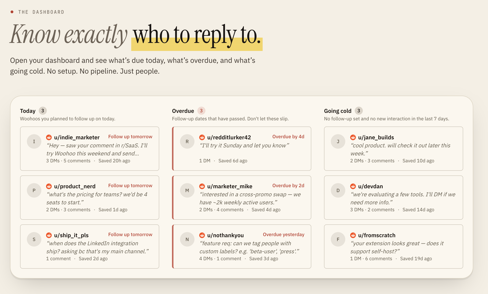

<div align="center">
  

Capture the DMs and comments worth acting on. Follow up before the moment's gone.

**Supported today:** Reddit · **Coming soon:** X, LinkedIn, and more

[Website](https://woohoo.to) · [Open App](https://woohoo.to/dashboard) · [Install Extension](https://woohoo.to/extension)

</div>

# woohoo

A lightweight follow-up tool for DMs and comments.

Save any DM or comment in one click from the browser extension. Everything from one person on one platform gets grouped into a thread (a **Woohoo**) with links back to the source. Set a follow-up date, and the dashboard nudges you on the day — **Follow up today**, **Overdue**, **Going cold**.

You still reply on the platform, like a human. Woohoo just makes sure nothing slips.

## Who it's for

Anyone whose leads, feedback, ideas, or criticism live inside DMs and comment threads.

- **Indie founders & solopreneurs** launching products and fielding "does it do X?" from commenters.
- **Freelancers & agencies** (web dev studios, designers, consultants) chasing inbound from posts or doing light outbound in communities.
- **Small clinics, coaches, and service businesses** — e.g. a mental health clinic running education content on LinkedIn or X, replying to DMs from potential clients.
- **Developers** — it's open source (AGPL), self-hostable, and the web + extension share one API you can poke at.

If you find yourself scrolling back through notifications three days later trying to remember who said what, this is for you.

## How it works

1. **Capture** — hover any DM or comment, click **Save**. Set an optional follow-up date. No tab switch, no copy-paste.
2. **Organize** — DMs and comments from the same person on the same platform are grouped into one Woohoo, automatically.
3. **Follow up** — the dashboard surfaces who's due today, who's overdue, and who's going cold. One click opens the conversation back on the platform.

## What it is. And what it isn't.

**It is:** a capture tool, a person-first timeline, a follow-up dashboard, and open source.

**It isn't:** an outbound tool (you reply manually), a full CRM (no deals, no pipeline, no forecast), a scheduler, or an analytics suite.

## Tech stack

npm workspace monorepo sharing one PostgreSQL database.

- **`web/`** — Next.js 16 (App Router, React 19), Tailwind v4, shadcn/ui, Prisma, better-auth. Self-hosted on a Hetzner VPS via Docker; `.github/workflows/deploy.yml` builds + pushes the image and redeploys over SSH.
- **`ext/`** — MV3 browser extension (React 19, Vite, `@crxjs/vite-plugin`). Builds both Chrome and Firefox artifacts.
- **`packages/ui`** — shared shadcn primitives.
- **`packages/api`** — shared API client and types consumed by both web and extension.

## Run it locally

```bash
cp .env.example .env   # fill in DATABASE_URL, BETTER_AUTH_SECRET, GOOGLE_CLIENT_ID/SECRET
make dev               # starts Postgres + tmux session with web and ext dev servers
```

Then load `ext/dist-chrome` as an unpacked extension in Chrome and visit `http://localhost:3000`.

See [`CLAUDE.md`](./CLAUDE.md) for the full architecture tour — data model, save routing rules, auth flow, and directory layout.

## 📜 License

[AGPL v3](LICENSE)

<p align="center">
  Built with 💙️ by <a href="https://mudgallabs.com" target="_blank">Mudgal Labs</a>
</p>
